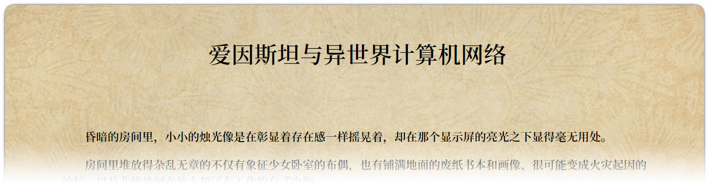

# 爱因斯坦与异世界计算机网络

在GitHub，甚至你还能写小说！

目标是超越[女装项目](https://github.com/komeiji-satori/Dress)，成为GitHub的支配者！

(？？？)

## 故事简介

爱因斯坦垄断了异世界互联网！

某人被美少女哄骗而加入了反抗组织IIIE！

今天也为了打败爱因斯坦而战斗着！

## 在线阅读

[https://rimochan.github.io/Einstein-and-The-Other-World-Computer-Network/](https://rimochan.github.io/Einstein-and-The-Other-World-Computer-Network/)

## 技术支持

[Librian: 簡明強大的 Galgame | Visual Novel 引擎](https://github.com/RimoChan/Librian)

